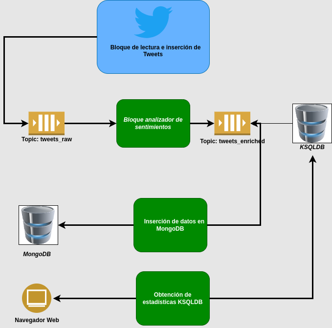
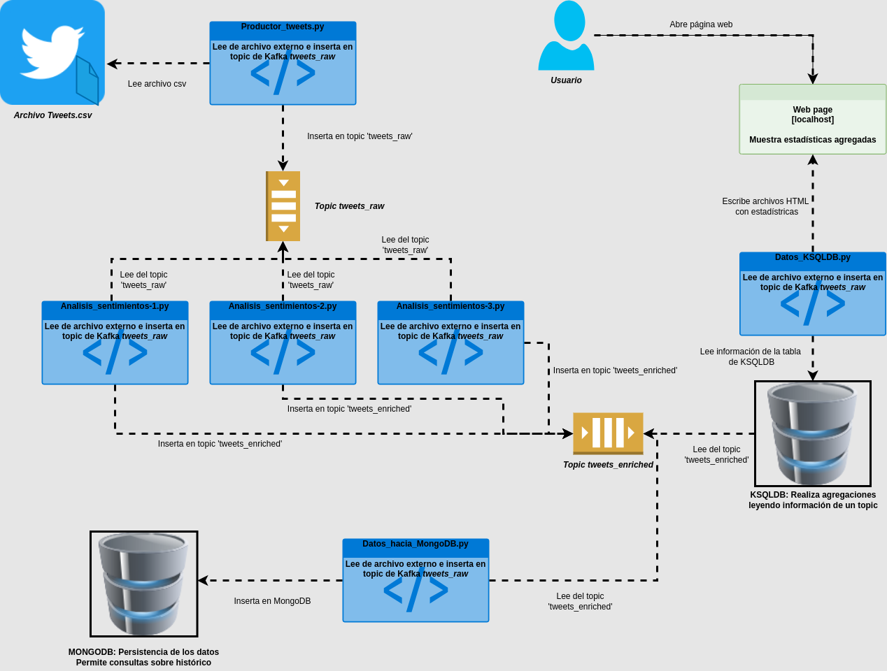

# DOCUMENTO DE DISEÑO

A continuación se describe el diseño realizado para completar la práctica

## Diagrama de arquitectura de componentes

## Diagrama de arquitectura del sistema software

## Justificación del diseño

La práctica está basada en las siguientes tecnologías:
* Scripts de Python
* Kafka: Se ha utilizado para comunicar a los diferentes procesos en un modelo de Producción-Suscripción, que permite que unos scripts se encarguen de introducir información en un topic sin preocuparse de la lectura de dicha información, y otros que se encarguen de leer esa información cuando se tiene acceso a ella. Para esta funcionalidad, Kafka es la solución perfecta. Además es fácilmente escalable.
* KSQLDB: Dentro del ecosistema de Kafka tenemos esta base de datos que permite leer la información de un topic y verla en una vista materializada, de manera que podamos realizar consultas sobre dicha vista y obtener resultados.
* MongoDB: Utilizado para persistir los datos en una base de datos
* Debido a la dificultad (por ser de pago) de acceder a los datos de Twitter directamente, se ha decidido descargar un archivo de ejemplo del repositorio de Kaggle
* Navegador web: Para mostrar los datos en tiempo real

## Descripción de componentes

### Dataset utilizado
El dataset utilizado se ha descargado del repositorio de datasets Kaggle:

https://www.kaggle.com/datasets/yasserh/twitter-tweets-sentiment-dataset

En este dataset hay una columna con un análisis de sentimientos ya realizado. Durante la fase de desarrollo se ha utilizado esta información para validar la librería de Python utilizada. No hay una coincidencia exacta en los resultados, pero en general, el resultado es bastante parecido.

### Productor_tweets.py

Este script lee el archivo csv descargado de Kaggle e procesa los Tweets en grupos de tamaño variable aleatoriamente para simular que se está leyendo el contenido en tiempo real.

La información se inserta en el topic 'tweets_raw' para su posterior procesamiento.

Se deja información en un log para revisar su funcionamiento.

### Analizador_sentimientos.py

Este script lee del topic 'tweets_raw' para extraer los Tweets que se deben procesar. Se le pasa un analizador de sentimientos y el resultado se añade al mensaje JSON y se inserta en otro topic, 'tweets_enriched'.

Para el análisis de sentimientos se ha utilizado la librería TextBlob de Python, que ha dado buenos resultados y responde bastante rápido en un entorno con recursos limitados.

### Datos_hacia_MongoDB.py

Este script lee del topic 'tweets_enriched' e inserta el JSON leído en una base de datos MongoDB, cuyo objetivo es la de persistir los datos para un posible posterior análisis.

Tanto en este paso, como en otros anteriores, se añade un timestamp para poder conocer los tiempos en los que se procesa la información.

### Datos_KSQLDB.py

Este script lee de la base de datos KSQLDB, que genera datos agregados basados en la información del topic 'tweets_enriched'.

La información leida se escribe cada varios segundos en un archivo html que se puede ver en un navegador web

### Topics Kafka

Los topics de Kafka se utilizan para comunicar los diferentes procesos que intervienen en la práctica.

Al crear los topics se han tenido en cuenta las siguientes consideraciones:
* Factor de replicación = 1. Debido a que solo tenemos un broker. Si se escalara la solución con más brokers se podrían aplicar un factor mayor
* Particiones = 3. Se ha pensado que el número de consumidores se aumente hasta 3 para balancear el procesamiento, que puede ser alto debido a la actividad de Twitter.

### KSQLDB

En la base de datos KSQLDB se ha creado un STREAM que lee del topic 'tweets_enriched' y una TABLE que almacena el resultado de agrupar por sentimiento detectado y realizar la cuenta en tiempo real. Estos datos se consultan, y se muestran en el navegador.

### Navegador web

Los archivos HTML generados se muestran en un navegador web. La información se actualiza de forma automática.

## Posibles Mejoras

Por falta de tiempo no se ha podido añadir más información para consulta en el entorno web. Se indican aquí algunas de ellas:

* Número total de documentos insertados en la base de datos MondoDB
* Sentimiento promedio: Se almacena en el JSON que se inserta en Kafka el valor de la polaridad. Se puede calcular un valor medio con un TABLE en KSQLDB y mostrar la polaridad y el sentimmiento que representa medios
* Kafka Connect: conectar a los tweets generados aleatoriamente en tiempo real y realizar la inserción en el topic de esta manera.
* Archivo genérico de configuración que permita configurar las diferentes partes, quizás desde el entorno web
* Poder modificar las estadísticas filtrando diferentes valores de polaridad, fechas...
* Se ha realizado un esfuerzo para conseguir un One-Click-Deployment. Queda como mejora tener un One-Click-Stop