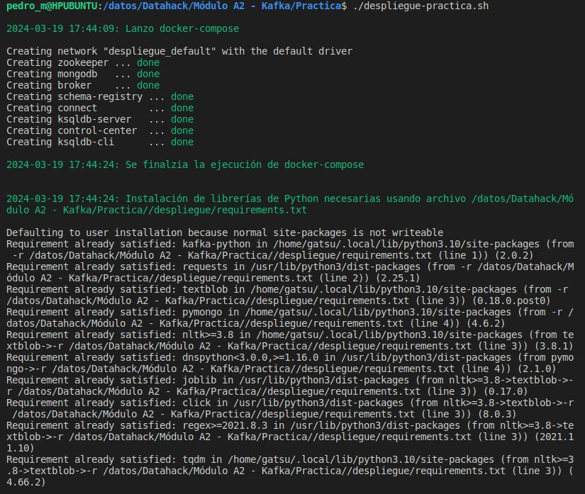
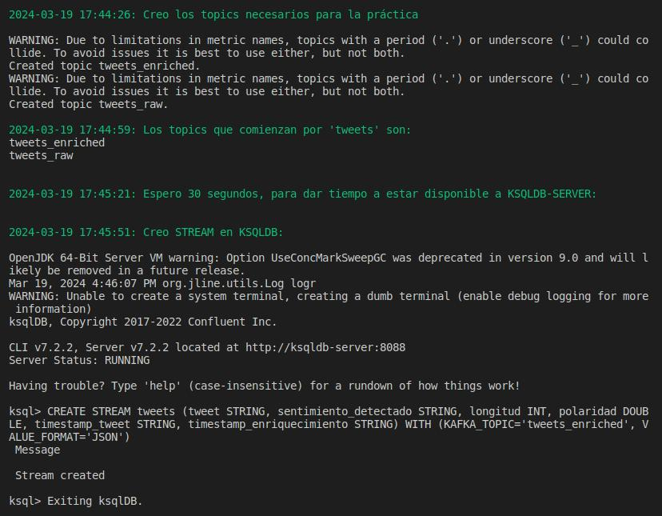
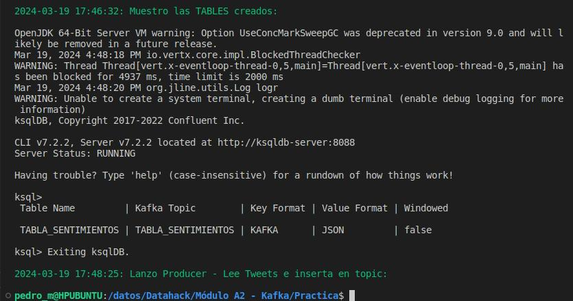

# MANUAL DE OPERACIÓN

## PROPÓSITO

En este manual se describen los pasos para poner en funcionamiento la práctica de Kafka

## DESCARGA DE ARCHIVOS NECESARIOS

Para comenzar a desplegar esta práctica, es necesario descargar todo el código disponible en el siguiente proyecto de Github:

* https://github.com/pedro-mtnz/practica-kafka

## CONTENIDO DEL PROYECTO

En este proyecto se encuentran las siguientes carpetas y archivos:
* README.md: Breve explicación de la práctica
* despliegue-practica.sh: Archive que ejecuta todos los pasos necesarios para que funcione la práctica
* datos: Archivo de datos necesario para simular la conexión a Twitter. Contiene un alto número de Tweets
* despliegue: Archivos necesarios para realizar el despliegue de la práctica:
    * docker-compose.yml: Archivo de docker compose que despliega los servicios necesarios
    * requirements.txt: Archivo utilizado para instalar las librerías de Python necesarias en este proyecto
* doc: Documentación del proyecto
* scripts: Scripts utilizados para realizar la funcionalidad del proyecto
* web: Archivos html necesarios para mostrar los resultados en un navegador web
* logs: Logs generados por los scripts

## CONFIGURACIÓN INICIAL

Es necesario realizar una pequeña configuración inicial antes de arrancar el proyecto:
* En el archivo despliegue-practica.sh hay una variable denomindada **PATH_BASE** en la que se debe indicar la ruta en la que se ha copiado este proyecto. Por ejemplo, si se ha copiado en ***/home/usuario/PracticaKafka*** la variable debe ser:

```
PATH_BASE="/home/usuario/PracticaKafka"
```

Una vez configurada esta variable, el resto de archivos y carpetas necesarios tendrán la ruta relativa a este path.

## DEPLIEGUE DEL PROYECTO

Para realizar el despliegue del proyecto es necesario ejecutar el archivo ***despliegue-practica.sh*** (Primero es necesario dar permisos de ejecución si no los tiene):

```
chmod 755 despliegue-practica.sh
./despliegue-practica.sh
```

Este script realiza las siguientes principales tareas:
* Ejecutar docker-compose
* Instalar librerías necesarias de Python
* Crear topics de Kafka
* Crear STREAMS y TABLES necesarias para KSQLDB
* Lanzar en segundo plano los scripts necesarios para el funcionamiento
* Lanzar en segundo plano un servidor web local

Por pantalla se muestran los pasos que se van ejecutando:







Al terminar devuelve el prompt al usuario.

## ENTORNO DE EJECUCIÓN

La práctica se ha desarrollado y probado en un entorno UBUNTU DESKTOP.

## EJECUCIÓN DE SCRIPTS

Una vez preparado todo el entorno, se ejecutan en segundo plano los scripts para realizar el análisis de sentimientos de Tweets y mostrar los resultados.

Los scripts ejecutados son los siguientes:
* Productor_tweets.py: Lee un archivo csv con tweets y los inserta en el topic de Kafka ***topic_raw***
* Analizador_sentimientos-x.py: Lee el topic ***topic_raw***, analiza cada tweet para evaluar el sentimiento y el resultado lo inserta enriquecido en el topic ***topic_enriched***
* Datos_KSQLDB.py: Lee los datos de la vista materializada creada en KSQLDB, que se alimenta del topic ***topic_enriched*** y genera un archivo html para mostrar los resultados en un navegador web
* Datos_hacia_MongoDB.py: Lee del topic ***topic_enriched*** e inserta cada registro JSON en la base de datos MongoDB para su posible posterior utilización.

## VISUALIZACIÓN DE LA INFORMACIÓN

Para ver la información es necesario abrir un navegador web y acceder a la siguiente URL:

```
localhost:8000/web/home.html
```

**NOTA:** En caso de que el puerto 8000 ya esté ocupado, es necesario matar el proceso 'python3 -m http.server 8000' y levantarlo de nuevo con un puerto diferente:

```
localhost:PORT/web/home.html
```

## PARADA

Una vez comprobado su funcionamiento, para parar es necesario:
* hacer un docker-compose down del proyecto
* Matar los procesos Python que se han lanzado: Se indica por pantalla sus PIDS


## TROUBLESHOOTING

Todo el sistema ha sido probado en el entorno indicado, un UBUNTU, y la ejecución ha sido satisfactoria. Sin embargo, es posible que pueda ocurrir algún error al lanzar los procesos o con alguna ruta, por lo que se indica cómo proceder:

* Los procesos Python se lanzan en segundo plano desde el script de despliegue, en caso de no funcionar correctamente, lanzar cada uno en una terminal separada:

```
python3 nombre_del script
```

* En algunos casos, atribuídos a los escasos recursos de la máquina de desarrollo, Docker se queda colgado y ha sido necesario parar todo, borrar contenedores y empezar desde cero.
* También ha pasado, debido a los recursos, que KSQLDB tarda mucho en arrancar y no carga bien los STREAMS y TABLES. Se solicita lanzar a mano los siguientes comandos desde una terminal:

```
docker exec -i ksqldb-cli ksql http://ksqldb-server:8088

CREATE STREAM tweets (tweet STRING, sentimiento_detectado STRING, longitud INT, polaridad DOUBLE, timestamp_tweet STRING, timestamp_enriquecimiento STRING) WITH (KAFKA_TOPIC='tweets_enriched', VALUE_FORMAT='JSON');
SHOW STREAMS;

CREATE TABLE tabla_sentimientos AS SELECT sentimiento_detectado, count(*) FROM tweets GROUP BY sentimiento_detectado EMIT CHANGES;
SHOW TABLES;
```