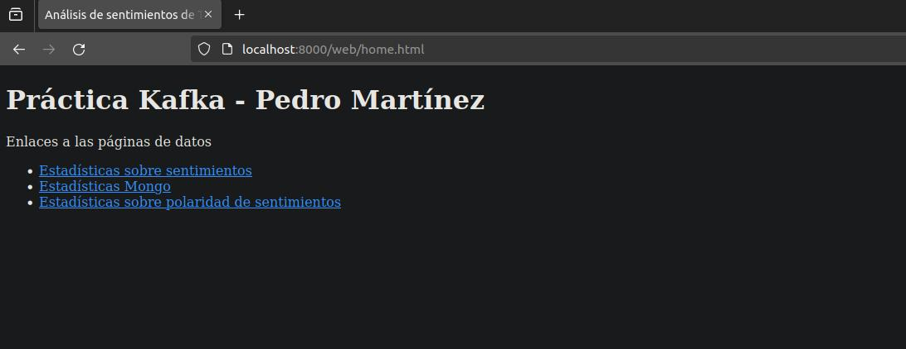
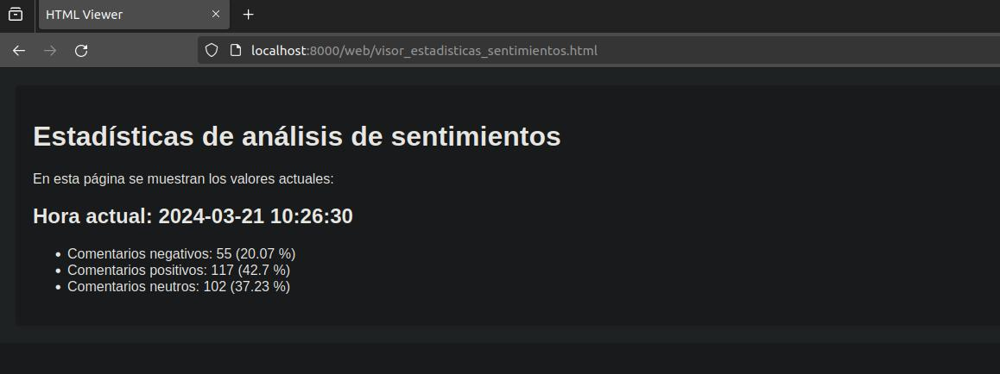

# MANUAL DE USO

## CONFIGURACIÓN

En el archivo ***despliuegue-practica.sh*** modificar la siguiente línea con el path donde se ha descargado la práctica:

```
PATH_BASE="/datos/Datahack/Módulo A2 - Kafka/Practica"
```

## VISUALIZACIÓN DE LA INFORMACIÓN

Una vez desplegado el sistema, con todos los scripts corriendo correctamente, la información se va procesando de forma automática y los resultados se pueden ver en la siguiente URL en un navegador web:

```
localhost:8000/web/home.html
```

Esta URL abre la página principal. Para ver el análisis de sentimientos acceder al enlace ***Estadísticas sobre sentimientos***




